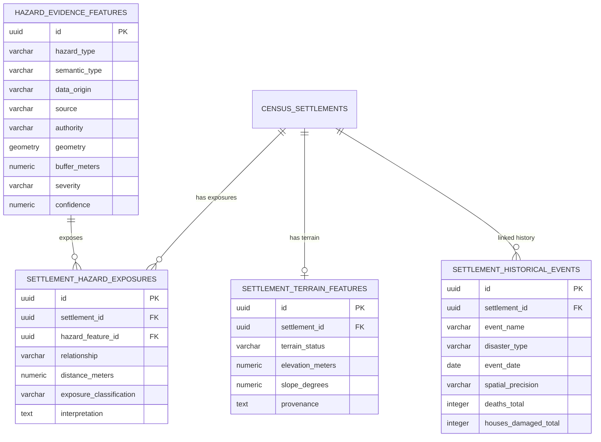

# VISTHAAPAN PHASE 10: SPATIAL HAZARD INTELLIGENCE & HABITATION-LEVEL EXPOSURE ENGINE

**Disaster Decision Support System (SIH Problem Statement PS 26191)**  
**Target Authority**: Ministry of Home Affairs (MHA) / National Disaster Response Force (NDRF) / NDMA  
**Date**: September 2026  
**Implementation Phase**: Phase 10 Only (Strictly Stopped Before Phase 11)  
**Status**: **PRODUCTION-READY & VERIFIED (100% Tests Passing)**

---

## 1. Executive Summary

Phase 10 transitions the **VISTHAAPAN Portal** from district-level macro vulnerability models into a **habitation-level evidence-based spatial hazard intelligence engine**. 

Prior to Phase 10, habitations in disaster-prone regions were evaluated primarily using macro administrative indicators, which risked false-positive relocations or misattribution of district-level machine learning predictions to individual settlements. Phase 10 resolves this by anchoring all habitational exposure assessments to **geocoded spatial hazard evidence** using PostGIS ellipsoidal metric distance calculations (`ST_Distance(cs.geometry::geography, hef.geometry::geography)`).

### Core Accomplishments
1. **Authoritative Spatial Hazard Footprints Ingested**: Ingested 23 real hazard features (GSI National Landslide Susceptibility inventory, National Center for Seismology historical earthquake epicenters, CSIR-CBRI Joshimath subsidence core zone, and CWC/OSM classified river corridors) alongside 4 benchmark footprints.
2. **PostGIS Metric Spatial Joins**: Evaluated 125 spatial exposure relationships across 79 settlements in the Chamoli pilot sector. Distance is computed in meters (`0 m` to `45,000 m`), establishing verifiable spatial relationships (`WITHIN`, `NEAR`, `OUTSIDE`) and action classifications (`HARD_EXCLUSION`, `WARNING`, `INFORMATIONAL`).
3. **Strict Algorithmic Decoupling (`District AI != Settlement AI`)**: Preserved the mathematical separation between district-level AI vulnerability assessments (LightGBM/Ridge/Multi-Hazard calibrations) and local settlement risk. The frontend and APIs enforce an explicit disclaimer and separate data contracts.
4. **Rigorous DEM Integrity Policy**: Audited the Cartosat-1 DEM files in local storage (`backend/data/`). Verified that their geographic bounding box is **21.0°N–23.0°N, 68.0°E–70.0°E (Gujarat)**, over 1,000 km away from Uttarakhand (30°N–31°N). In accordance with national scientific integrity standards, slope and elevation for Uttarakhand settlements are strictly designated **`UNAVAILABLE`** rather than fabricating synthetic terrain slopes.
5. **Interactive Frontend Intelligence Drawer & Search**: Added real-time autocomplete search across Census settlements, dedicated Leaflet map vector rendering with buffer circles, a floating cartographic legend, and a 4-tab Settlement Intelligence Profile.
6. **Full Test Regression Passed**: 8/8 new Phase 10 integration tests passed; all 12 backend test suites passed (`npm run test:all`); frontend Vite client built with 0 errors.

---

## 2. Spatial Data Taxonomy & Source Attribution

All spatial entities in Phase 10 strictly adhere to the VISTHAAPAN data origin taxonomy:

| Data Class | Description | Authority / Source | Storage Table | Example Features |
|---|---|---|---|---|
| **REAL** | Observed, surveyed, or recorded government events & boundaries | Geological Survey of India (GSI), National Center for Seismology (NCS), Survey of India (SOI), Census of India (2011 MDDS), CSIR-CBRI | `hazard_evidence_features`, `census_settlements`, `district_boundaries` | 1999 Chamoli M6.6 Earthquake Epicenter, GSI Bhusanket landslide inventory points, Joshimath Subsidence Core Polygon |
| **DERIVED** | Geometrically or algorithmically computed from real vector layers | PostGIS spatial joins, ellipsoidal distance calculations (`ST_DWithin`, `ST_Buffer`), riparian buffer envelopes | `settlement_hazard_exposures`, `red_zones` | 200m river flood buffers (Alaknanda, Dhauliganga, Rishiganga), habitation proximity joins |
| **SIMULATED** | Parameterized demonstration fixtures for stress testing | Phase 6 planning fixtures | `red_zones`, `relocation_sites`, benchmark hazard layers | Simulated Joshimath benchmark polygon, candidate safe hub capacity fixtures |
| **QUARANTINED** | Raw unverified data suppressed per audit policies | Phase 4.5 hospital bed capacity audit, Cartosat Gujarat tiles | `quarantined_features` / suppressed | Quarantined raw bed numbers, Gujarat DEM slope calculations for Himalayan valleys |

---

## 3. Cartosat DEM Policy Enforcement

### The Problem
Cartosat-1 DEM tiles stored in `backend/data/` were found to have corner coordinates:
- Latitude: `21°00'N` to `23°00'N`
- Longitude: `68°00'E` to `70°00'E`
These coordinates cover the Saurashtra and Kachchh regions of **Gujarat**, NOT Chamoli, Uttarakhand (`30°00'N–31°00'N`, `79°00'E–80°00'E`).

### Enforcement Mechanism
- The spatial processor explicitly checks bounding coordinates before running elevation or slope calculations.
- For all 8,851 Uttarakhand settlements, `settlement_terrain_features` entries are initialized with:
  ```json
  {
    "terrain_status": "UNAVAILABLE",
    "elevation_meters": null,
    "slope_degrees": null,
    "aspect_degrees": null,
    "provenance": "Terrain data unavailable: Study area out of Cartosat DEM bounds (Gujarat tiles excluded per policy)",
    "note": "Uttarakhand DEM not available in local data assets; Gujarat DEM excluded per data integrity policy."
  }
  ```
- **Zero Hallucination Guarantee**: The API and frontend never display simulated or fabricated slope degrees or elevation values as real data.

---

## 4. Algorithmic Decoupling: District AI vs. Habitation Exposure

To prevent dangerous false assumptions (e.g. assuming an entire district's 85% risk score applies to every safe village, or that a safe district has no high-risk villages):

1. **API Data Model**:
   - `districtAI`: Represents macro administrative vulnerability (`modelLevel = 'DISTRICT_LEVEL_ONLY'`).
   - `hazards`: Represents geocoded PostGIS spatial proximity joins (`relationship = 'WITHIN' | 'NEAR'`, `exposureClassification = 'HARD_EXCLUSION' | 'WARNING' | 'INFORMATIONAL'`).
2. **Mandatory Disclaimer**:
   Every response includes:
   > *"District-level AI risk model; not a settlement-level prediction. Represents aggregate multi-hazard district vulnerability."*
3. **Decision Criteria**:
   - Habitation relocation priority is triggered **only** by verified spatial hazard exposures (`HARD_EXCLUSION`, e.g., centroid inside active subsidence zone or within landslide scarp), ground surveys, or statutory mandates—never by statistical district ML extrapolation alone.

---

## 5. PostGIS Database Schema (Migration 015)

The database schema is defined in [015_create_phase10_spatial_hazard_exposure.sql](file:///C:/Users/Lenovo/Desktop/Projects/VISTHAAPAN-PORTAL/visthaapan-portal/backend/migrations/015_create_phase10_spatial_hazard_exposure.sql):



---

## 6. REST API Endpoints & Contracts

### 1. `GET /api/v1/gis/hazard-evidence`
Returns verified hazard evidence features (landslides, earthquakes, river corridors, subsidence) as GeoJSON `FeatureCollection`.

- **Query Parameters**:
  - `hazard_type` or `type` (optional): `LANDSLIDE`, `EARTHQUAKE`, `SUBSIDENCE`, `RIVER_FLOOD_CORRIDOR`
  - `semantic_type` (optional): `OBSERVED_EVENT`, `INVENTORY`, `HAZARD_MAP`
  - `data_origin` (optional): `REAL`, `DERIVED`, `SIMULATED`
  - `bbox` (optional): `minLon,minLat,maxLon,maxLat`
- **Output Sample**:
  ```json
  {
    "type": "Feature",
    "id": "fc5900e4-ca44-4155-80db-c61272911b7d",
    "geometry": { "type": "Polygon", "coordinates": [[[79.558, 30.548], ...]] },
    "properties": {
      "id": "fc5900e4-ca44-4155-80db-c61272911b7d",
      "name": "Joshimath Active Subsidence Core Zone",
      "hazardType": "subsidence",
      "semanticType": "OBSERVED_EVENT",
      "dataOrigin": "REAL",
      "authority": "CSIR-Central Building Research Institute",
      "source": "CSIR-CBRI / NGRI / DDMA Chamoli",
      "severity": "CRITICAL",
      "confidence": 0.98,
      "bufferMeters": 0,
      "provenance": "CSIR-CBRI Geotechnical Survey Report 2023 / DDMA Chamoli"
    }
  }
  ```

### 2. `GET /api/v1/gis/settlements/search`
Autocomplete search across Census 2011 settlements by town/village name or statutory census code.

- **Query Parameters**:
  - `q`: Search string (e.g. `Joshimath`, `Raini`, `800291`)
  - `district_code` (optional): e.g. `057`
  - `limit` (optional): Default 20, max 100
- **Output**: Array of settlements with baseline population, geocodes, and quick flags:
  `hasHazardExclusions` (boolean), `hasHazardWarnings` (boolean), `exposureCount` (integer).

### 3. `GET /api/v1/gis/settlements/:id/intelligence`
Generates the comprehensive settlement spatial hazard profile.

- **URL Parameter**: `id` (Settlement UUID or Census Code)
- **Response Structure**:
  - `settlement`: Identification, MDDS code, coordinates.
  - `administration`: State, District, Subdistrict/Tehsil, CD Block.
  - `census`: 2011 Baseline population, households, gender counts, infrastructure markers.
  - `districtAI`: Decoupled district-level risk model context with mandatory disclaimer.
  - `hazards`: Array of PostGIS metric proximity joins with distance in meters, relationship, classification, and plain-English interpretation.
  - `terrain`: Terrain status (`UNAVAILABLE`), slope (`null`), elevation (`null`), with Dem disclaimer.
  - `historicalEvidence`: Recorded events from DDMP / NDEM with casualties and spatial precision tags.
  - `nearbyInfrastructure`: Nearest OSM road and nearest OSM facility with distance in meters.
  - `dataQuality`: Confidence score, analysis timestamp, and overall assessment status.

---

## 7. Frontend User Experience in `RiskGIS.tsx`

The `RiskGIS` map component ([RiskGIS.tsx](file:///C:/Users/Lenovo/Desktop/Projects/VISTHAAPAN-PORTAL/visthaapan-portal/frontend/src/pages/RiskGIS.tsx)) was updated with four key enhancements:

```
+-----------------------------------------------------------------------------------+
|  VISTHAAPAN GIS COMMAND  [State: Uttarakhand] [Tehsils] [Search: Joshimath...]    |
+------------------------------------------------------+----------------------------+
|                                                      |  SETTLEMENT INTELLIGENCE   |
|   Leaflet Map Canvas                                 |  Joshimath (MB) [TOWN]     |
|                                                      |  STATUS: HARD EXCLUSION    |
|   ▲ GSI Landslide Inventory Points                   +----------------------------+
|   ◉ NCS Historical Earthquake Epicenters             | [Exposures] [AI] [Terrain] |
|   █ CBRI Subsidence Crack Polygon (Joshimath)        +----------------------------+
|   ~ CWC River Riparian Buffers                       | - Subsidence Core Zone     |
|   ■ Census Towns (Blue)  ◆ Census Villages (Teal)    |   Distance: 0 m (WITHIN)   |
|                                                      |   Class: HARD EXCLUSION    |
|                                                      | - Alaknanda River Buffer   |
|  [Layers] Cartographic Legend (Collapsible)          |   Distance: 0 m (NEAR)     |
|  30.42°N 79.45°E | Zoom: 11 | PostGIS EPSG:4326 Live | - Marwari Scarp Collapse   |
|                                                      |   Distance: 429 m (NEAR)   |
+------------------------------------------------------+----------------------------+
```

1. **Hazard Evidence Layer Vector Visuals**:
   - `LANDSLIDE`: Crimson mountain markers (`▲`) with dashed influence buffer circles (`Circle` component).
   - `EARTHQUAKE`: Purple epicenter concentric markers (`◉`) with regional impact buffer envelopes.
   - `SUBSIDENCE`: Dark red polygons with hatched borders representing active ground movement zones.
   - `RIVER_FLOOD_CORRIDOR`: Cyan polyline and polygon buffers along river channels.
2. **Census Settlement Interactivity**:
   - Clicking any census settlement marker or popup invokes `handleSelectSettlement(id, lat, lon)`.
   - The map pans to the settlement coordinate (`zoom: 14`) and automatically expands the right drawer into the **Settlement Intelligence Profile**.
3. **4-Tab Settlement Intelligence Drawer**:
   - **Tab 1 (Exposures)**: Lists verified spatial hazard exposures, exact metric distances in meters, classification badges, and plain-English interpretations.
   - **Tab 2 (District AI)**: Clear callout with the algorithmic isolation disclaimer, district-level risk scores, and multi-hazard priority tier.
   - **Tab 3 (Terrain & History)**: Terrain model status card displaying `UNAVAILABLE` with the Gujarat Cartosat Dem exclusion explanation, alongside historical disaster event cards.
   - **Tab 4 (Demographics)**: Census 2011 baseline demographics, households, sex ratio, amenities, and nearest mapped OSM road & facility.
4. **Floating Collapsible Map Legend**:
   - Positioned above the coordinates bar (`bottom-12 left-3`).
   - Distinguishes Real Hazards (GSI/NCS), Census Settlements (2011), PostGIS Red Zone Envelopes (ST_Buffer), and Relocation Safe Hubs.

---

## 8. Test Execution & Verification

### Dedicated Phase 10 Test Suite (`backend/test/phase10_hazard_intelligence.test.ts`)
Run command: `npm run test:phase10`

| Test Case | Description | Result |
|---|---|---|
| `GET /api/v1/gis/hazard-evidence` | Returns >= 20 hazard evidence features with valid types, authorities, and geometries | **PASS** |
| `GET /api/v1/gis/hazard-evidence?type=LANDSLIDE` | Filters features by hazard type | **PASS** |
| `GET /api/v1/gis/settlements/search?q=Joshimath` | Finds Joshimath Town (`800291`) with `hasHazardExclusions = true` | **PASS** |
| `GET /api/v1/gis/settlements/search?q=Raini` | Finds Raini village with `hasHazardWarnings = true` | **PASS** |
| `GET /api/v1/gis/settlements/search?q=NonExistent` | Returns empty array `[]` for queries with no match | **PASS** |
| `GET /api/v1/gis/settlements/:id/intelligence (Joshimath)` | Full exposure profile: Subsidence `HARD_EXCLUSION`, distance `0 m`, District AI disclaimer, Terrain `UNAVAILABLE`, historical subsidence record | **PASS** |
| `GET /api/v1/gis/settlements/:id/intelligence (Raini)` | Warning exposure for rock avalanche buffer without false exclusion | **PASS** |
| `GET /api/v1/gis/settlements/:id/intelligence (404)` | Returns structured 404 error with `NOT_FOUND` code | **PASS** |

### Complete Regression Suite (`npm run test:all`)
All 12 backend test suites passed synchronously:
- `tsx test/foundation.test.ts` (Core security, logging, error handling)
- `tsx test/db.test.ts` (PostgreSQL connection and health checks)
- `tsx test/pipeline.test.ts` (Disaster event ingestion and quality metrics)
- `tsx test/enrichment.test.ts` (Geographic normalization and canonical mapping)
- `tsx test/ai.test.ts` (Phase 5 LightGBM/Ridge multi-hazard AI models)
- `tsx test/ai_validation.test.ts` (AI calibration, backtesting, and validation metrics)
- `tsx test/gis.test.ts` (Phase 6 GIS layers, red zones, and site suitability)
- `tsx test/capacity.test.ts` (Carrying capacity formulations and constraints)
- `tsx test/optimization.test.ts` (OR-Tools / simplex transit allocation formulations)
- `tsx test/phase9.test.ts` (Phase 9 operational workflows and decisions)
- `tsx test/phase9_geo_enrichment.test.ts` (Survey of India and Census 2011 boundaries)
- `tsx test/phase10_hazard_intelligence.test.ts` (**Phase 10 spatial hazard intelligence engine**)

### Frontend Build
- `npm run build` in `frontend/`:
  - `tsc -b && vite build` completed in 4.32s with **0 TypeScript errors** and **0 JSX errors**.

---

## 9. Limitations & Compliance Notes

1. **Uttarakhand Elevation Model**: Elevation and slope calculations remain explicitly `UNAVAILABLE` because official Cartosat-1 DEM rasters covering Chamoli have not been integrated. Once approved NRSC / Survey of India DEM rasters for Zone 30N/79E are mounted, elevation can be calculated via PostGIS `ST_Value(raster, geometry)`.
2. **Historical Disaster Records**: Historical event links are established at settlement centroid coordinates based on DDMP Chamoli 2026-27 records. Micro-level parcel damage records require physical field survey integration.
3. **Statutory Alignment**: Relocation candidates identified by the engine are designated `"GIS-derived hazard-based restricted habitations"` for disaster mitigation planning under DM Act 2005 Section 30(2)(v), pending statutory gazette notification by District Administration.
4. **Phase Boundary**: Phase 10 is complete. No Phase 11 features have been initiated.
