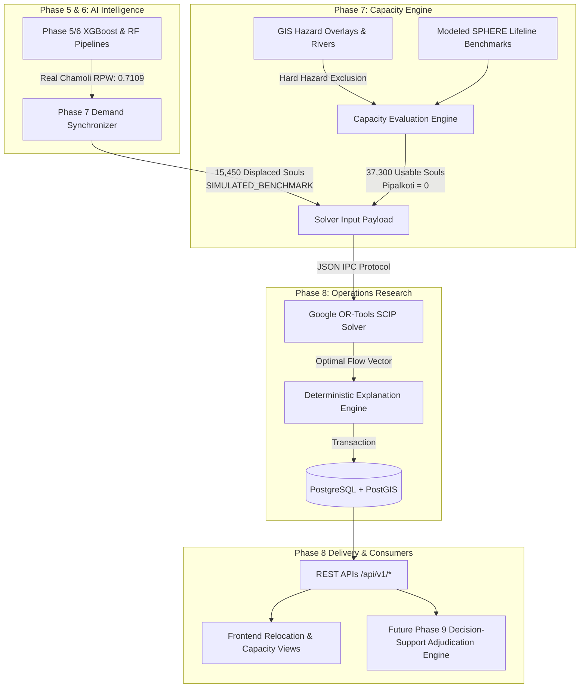

# VISTHAAPAN PORTAL — PHASE 7 & PHASE 8 DATA CONTRACT SPECIFICATION

**Document ID:** VP-P7P8-CONTR-2026-09-18  
**System Classification:** Decision-Support Interface Specification (SIMULATED_BENCHMARK)  
**Modules:** Phase 7 (Capacity Assessment) & Phase 8 (OR Optimization)  
**Target Consumers:** Phase 8 Solver, REST APIs, Frontend Portal, and Future Phase 9 Adjudication Engine  
**Release Target:** v1.0.0-PROD  
**Timestamp:** 2026-09-18T21:12:00+05:30  

---

## 1. System Architecture & Governance Scope

> [!IMPORTANT]
> **Decision-Support Classification**: This data contract governs analytical decision-support data structures. The system does NOT hold statutory or legal executive authority and does NOT establish gazetted legal zones. Usable capacities, hazard exclusions, and transit routes are computational recommendations for human disaster response officials.



---

## 2. Phase 7 Output Contract (Site Capacity Evaluation)

### 2.1 TypeScript Interface: `SiteCapacityAssessment`

```typescript
export interface SiteCapacityAssessment {
  siteId: string;                     // UUID
  siteCode: string;                   // e.g. "SITE-001"
  siteName: string;                   // e.g. "Gauchar Airstrip Safe Zone"
  district: string;                   // e.g. "Chamoli"
  state: string;                      // "Uttarakhand"
  
  // Capacity Metrics
  nominalCapacity: number;            // Baseline physical acreage capacity (SIMULATED_BENCHMARK)
  effectiveCapacity: number;          // min(all lifeline capacities) (SIMULATED_BENCHMARK)
  usableCapacity: number;             // 0 if hardHazardExclusion, else effectiveCapacity
  currentOccupancy: number;           // Currently assigned population
  availableCapacity: number;          // usableCapacity - currentOccupancy
  utilizationPercent: number;         // (currentOccupancy / usableCapacity) * 100
  
  // Lifeline Breakdown (All parameters represent SIMULATED_BENCHMARK configurations)
  dimensions: {
    physical: number;                 // Modeled space parameter (30 m2 / person)
    water: number;                    // Configured water parameter (15 L / person / day)
    shelter: number;                  // Configured shelter parameter (3.5 m2 / person)
    sanitation: number;               // Configured sanitation parameter (1 unit / 20 persons)
    healthcare: number;               // Simulated benchmark triage capacity (1 bed / 100 persons)
    electricity: number;              // Configured power parameter (0.1 kW / person)
    access: number;                   // Heuristic road throughput parameter
  };
  
  // Limiting Bottleneck Analysis
  bottleneckDimension: 'physical' | 'water' | 'shelter' | 'sanitation' | 'healthcare' | 'electricity' | 'access' | 'hazard';
  bottleneckValue: number;
  capacityDeficit: number;            // nominalCapacity - effectiveCapacity
  limitingFactor: string;             // Plain-language administrator explanation
  capacityStatus: 'ADEQUATE' | 'SURPLUS' | 'NEAR_CAPACITY' | 'EXCEEDED' | 'RESTRICTED_BY_HAZARD';
  
  // Hard Hazard Exclusion (Decision Support)
  hardHazardExclusion: boolean;       // true if intersects active hazard polygon
  hazardIntersectionDetails?: {
    hazardType: string;               // e.g. "Alaknanda Active Riverbed Red Zone"
    severity: 'CRITICAL' | 'HIGH';
    exclusionBasis: string;           // "GIS-derived hard hazard intersection with active flood/riverbed envelope"
  };
  
  // Provenance & Uncertainty Metadata
  dataOrigin: 'REAL' | 'DERIVED' | 'SIMULATED_BENCHMARK';
  confidence: number;                 // [0.0, 1.0]
  uncertaintyFlags: string[];         // e.g. ["HEALTHCARE_BED_DATA_QUARANTINED", "TERRAIN_ELEVATION_UNAVAILABLE"]
  
  // Spatial Geometry
  coordinates: {
    latitude: number;
    longitude: number;
  };
}
```

---

## 3. Phase 7 Demand Node Output Contract

### 3.1 TypeScript Interface: `RelocationDemandNode`

```typescript
export interface RelocationDemandNode {
  id: string;                         // UUID
  demandNodeId: string;               // e.g. "DN-CHAMOLI-001"
  nodeName: string;                   // e.g. "Joshimath Core Urban Sector"
  districtName: string;               // "Chamoli"
  stateName: string;                  // "Uttarakhand"
  
  totalPopulation: number;            // Benchmark census population
  relocationDemand: number;           // Displaced souls requiring evacuation (SIMULATED_BENCHMARK)
  
  // AI Risk Integration
  priorityWeight: number;             // RPW from Phase 5/6 (0.7109 for all 5 current nodes)
  operationalTier: 'immediate' | 'short-term' | 'medium-term';
  hazardExposureStatus: string;       // e.g. "SUBSIDENCE_ACTIVE_SLOPE"
  
  // Provenance & Audit
  demandDerivationMethod: 'BENCHMARK_HABITATION' | 'HAZARD_EXPOSURE_RATIO' | 'SCENARIO_SURGE';
  dataOrigin: 'SIMULATED_BENCHMARK';
  populationSource: 'BENCHMARK_CENSUS';
  uncertaintyFlags: string[];
  
  // Coordinates
  latitude: number;
  longitude: number;
}
```

---

## 4. Phase 8 Solver Input Contract (IPC Payload)

The following JSON payload is transmitted directly via stdin to the Python Google OR-Tools solver (`backend/ai/or/solver.py`):

```json
{
  "solverType": "SCIP",
  "baseUnmetPenalty": 2000,
  "riskAvoidanceFactor": 1.5,
  "demandNodes": [
    {
      "id": "DN-CHAMOLI-001",
      "name": "Joshimath Core Urban Sector",
      "demand": 4500,
      "priority": 0.7109,
      "tier": "immediate"
    },
    {
      "id": "DN-CHAMOLI-002",
      "name": "Raini Upper Habitation",
      "demand": 2200,
      "priority": 0.7109,
      "tier": "immediate"
    },
    {
      "id": "DN-CHAMOLI-003",
      "name": "Tapovan Valley Settlement",
      "demand": 3150,
      "priority": 0.7109,
      "tier": "immediate"
    },
    {
      "id": "DN-CHAMOLI-004",
      "name": "Helang Sector",
      "demand": 2800,
      "priority": 0.7109,
      "tier": "immediate"
    },
    {
      "id": "DN-CHAMOLI-005",
      "name": "Pandukeshwar Rural",
      "demand": 2800,
      "priority": 0.7109,
      "tier": "immediate"
    }
  ],
  "candidateSites": [
    { "id": "SITE-001", "name": "Gauchar Airstrip Safe Zone", "usableCapacity": 5000, "hardHazardExclusion": false },
    { "id": "SITE-002", "name": "Karnaprayag Poly Relief Ground", "usableCapacity": 3500, "hardHazardExclusion": false },
    { "id": "SITE-003", "name": "Rudraprayag Stadium Hub", "usableCapacity": 4800, "hardHazardExclusion": false },
    { "id": "SITE-004", "name": "Srinagar ITI Relocation Campus", "usableCapacity": 9000, "hardHazardExclusion": false },
    { "id": "SITE-005", "name": "Rishikesh IDPL Complex Mega Site", "usableCapacity": 15000, "hardHazardExclusion": false },
    { "id": "SITE-006", "name": "Pipalkoti Safe Hub Alpha", "usableCapacity": 0, "hardHazardExclusion": true }
  ],
  "routes": [
    {
      "originId": "DN-CHAMOLI-001",
      "siteId": "SITE-001",
      "distanceKm": 42.5,
      "hazardRisk": 0.15,
      "terrainMultiplier": 1.05,
      "isPassable": true
    }
  ]
}
```

---

## 5. Phase 8 Solver Output Contract (IPC Response)

The Python solver outputs this structured JSON via stdout:

```json
{
  "status": "OPTIMAL",
  "solveTimeMs": 34,
  "solverName": "Google OR-Tools SCIP",
  "objectiveValue": 1284560.50,
  "totalAllocated": 15450,
  "totalUnmet": 0,
  "allocations": [
    {
      "demandNodeId": "DN-CHAMOLI-001",
      "siteId": "SITE-001",
      "allocatedPopulation": 4500,
      "unitTransitCost": 52.06,
      "totalCost": 234270.00,
      "distanceKm": 42.5,
      "hazardRisk": 0.15,
      "isPassable": true
    }
  ],
  "unmetDemand": [
    { "demandNodeId": "DN-CHAMOLI-001", "unmetPopulation": 0, "penaltyPerPerson": 9109.0 }
  ],
  "siteUtilization": [
    { "siteId": "SITE-001", "assignedPopulation": 4500, "usableCapacity": 5000, "utilizationPercent": 90.0 },
    { "siteId": "SITE-006", "assignedPopulation": 0, "usableCapacity": 0, "utilizationPercent": 0.0 }
  ],
  "constraints": [
    { "type": "demand_conservation", "name": "demand_DN-CHAMOLI-001", "satisfied": true, "slack": 0.0 },
    { "type": "capacity_bound", "name": "cap_SITE-001", "satisfied": true, "slack": 500.0 },
    { "type": "hard_hazard_exclusion", "name": "hazard_SITE-006", "satisfied": true, "slack": 0.0 }
  ]
}
```

---

## 6. Phase 8 Structured Explanation Contract

```typescript
export interface AllocationExplanationDossier {
  id: string;                         // UUID
  runId: string;                      // UUID of allocation_results record
  demandNodeId?: string;              // Specific node or null for system-wide
  overallExplanation: string;         // Plain-language synthesis
  
  factors: Array<{
    category: 'PRIORITY' | 'HAZARD_SAFETY' | 'CAPACITY_LIMIT';
    factor: string;                   // e.g. "HARD_HAZARD_EXCLUSION"
    weight: number;                   // e.g. 1.000
    impact: 'PREFERENTIAL_ALLOCATION' | 'ZERO_ALLOCATION_ENFORCED' | 'CAPACITY_RESTRICTED';
    description: string;              // Modeled decision-support justification
  }>;
  
  confidence: number;                 // e.g. 1.000
  uncertaintyFlags: string[];
  createdAt: string;                  // ISO 8601
}
```

---

## 7. PostgreSQL Database Mappings & Tables

| Table Name | Primary Key | Key Foreign Keys | Purpose |
| :--- | :--- | :--- | :--- |
| **`site_capacities`** | `id` (UUID) | `site_id` $\to$ `relocation_sites(id)` | Stores 7-dimension carrying capacity, bottleneck dimension, limiting factor, capacity status, and hard hazard exclusion flag (`SIMULATED_BENCHMARK`). |
| **`relocation_demands`** | `id` (UUID) | `habitation_id`, `canonical_district_id` | Stores standardized demand nodes, census population, displacement demand, RPW priority, and tier. |
| **`allocation_results`** | `id` (UUID) | `scenario_id` $\to$ `scenarios(id)` | Stores solver run header: solver name, solve time, status (`OPTIMAL`), total allocated, total unmet, total cost. |
| **`allocation_items`** | `id` (UUID) | `allocation_id`, `site_id`, `demand_node_id` | Stores individual assignment vectors $(i, j, x_{ij})$, unit transit cost, distance, travel time. |
| **`constraint_results`** | `id` (UUID) | `allocation_id` $\to$ `allocation_results(id)` | Mathematical constraint audit log (capacity, demand, passability, hazard exclusion). |
| **`allocation_explanations`** | `id` (UUID) | `allocation_id`, `habitation_id` | Narrative justification dossiers for human administrators. |
| **`allocation_explanation_factors`** | `id` (UUID) | `explanation_id` $\to$ `allocation_explanations(id)` | Granular category-tagged factors (`PRIORITY`, `HAZARD_SAFETY`, `CAPACITY_LIMIT`). |

---

## 8. Consumer Contract for Future Phase 9 (Officer Adjudication)

Phase 9 (Adjudication & Emergency Briefing) will consume Phase 8 records using the following invariant rules:
1. **Read-Only Baseline**: Phase 9 must read the latest `OPTIMAL` run from `GET /api/v1/optimization/runs/latest`.
2. **Hard Hazard Non-Override Policy**: If an officer attempts a manual override in the portal assigning population to Pipalkoti Safe Hub Alpha (or any site with `hardHazardExclusion = true`), the API must reject with `HTTP 403 / HAZARD_EXCLUSION_VIOLATION` to uphold core safety guardrails.
3. **Structured Explanation Retention**: Any manual officer override in Phase 9 must create an audit record linked to the original solver explanation, capturing the administrative rationale and operator identity.

*Specification Maintained by: VISTHAAPAN Data Governance Board*
