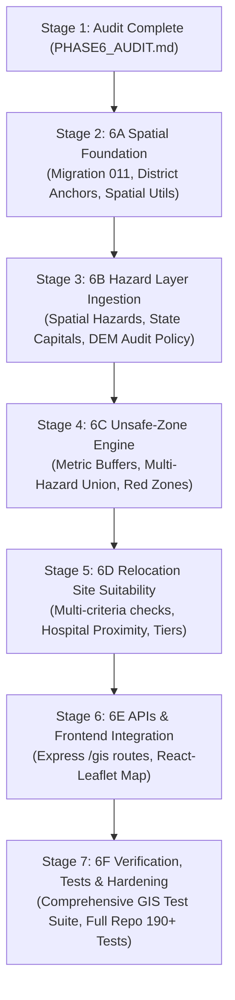

# PHASE 6 — GIS HAZARD, UNSAFE-ZONE & SPATIAL SUITABILITY AUDIT REPORT
**Authoritative Architectural & Spatial Inventory**
**Project:** VISTHAAPAN Portal (PS 26191)
**Date:** September 2026
**Status:** STAGE 1 AUDIT COMPLETE — PRE-IMPLEMENTATION BASELINE

---

## Executive Summary
This document constitutes the comprehensive, non-destructive **Stage 1 Spatial Audit** for **Phase 6: GIS Hazard, Unsafe-Zone & Spatial Suitability Engine**. It independently examines the live PostgreSQL 16.4 + PostGIS 3.4 database, existing migrations (001–010), backend services, Python AI subsystems, frontend Leaflet components, and physical data files.

All 164 existing automated tests across Phases 1 through 5.1 are passing without errors:
- Foundation & Middleware: 6/6
- Database Foundation & PostGIS: 9/9
- Ingestion Pipeline: 10/10
- Phase 4.5 Demographics & Healthcare Enrichment: 39/39
- Phase 5 AI Intelligence Engine: 75/75
- Phase 5.1 AI Validation & Semantics: 25/25
**Total Passing Baseline:** 164 / 164 tests.

---

## 1. Existing Spatial Schema & PostGIS Setup

### 1.1 Database Engine & PostGIS Version
- **PostgreSQL Version:** PostgreSQL 16.4 (Debian 16.4-1.pgdg110+2) on x86_64, compiled by gcc (Debian 12.2.0-14) 12.2.0, 64-bit.
- **PostGIS Extension Version:** `3.4 USE_GEOS=1 USE_PROJ=1 USE_STATS=1` (Extension `postgis` enabled in migration `001_enable_postgis.sql`).
- **Additional Extensions:** `uuid-ossp` (v1.1).
- **Coordinate Reference System (CRS) Policy:** Canonical storage standard is **`EPSG:4326`** (WGS84, lat/lon degrees). Metric operations (distance, buffer, area) use geodesic geography casting (`ST_Distance(geom::geography, ...)` or `ST_DWithin(geom::geography, ...)`) or project to UTM Zone 44N (`EPSG:32644`) / Web Mercator (`EPSG:3857`).

### 1.2 Existing Geometry Columns (All registered in `geometry_columns` with SRID 4326)
| Table Name | Geometry Column | PostGIS Spatial Type | SRID | Current Row Count | Spatial Population |
| :--- | :--- | :--- | :--- | :--- | :--- |
| `regions` | `boundary_geometry` | `MULTIPOLYGON` | 4326 | 4 | 4 bounding boxes (SIMULATED) |
| `habitations` | `geometry` | `POINT` | 4326 | 5 | 5 points (SIMULATED Chamoli) |
| `hazard_layers` | `geometry` | `GEOMETRY` | 4326 | 0 | 0 (Unpopulated) |
| `historical_disaster_events` | `geometry` | `GEOMETRY` | 4326 | 0 | 0 (Unpopulated) |
| `red_zones` | `geometry` | `MULTIPOLYGON` | 4326 | 0 | 0 (Unpopulated) |
| `relocation_sites` | `geometry` | `POINT` | 4326 | 6 | 6 points (SIMULATED safe hubs) |
| `roads` | `geometry` | `MULTILINESTRING` | 4326 | 0 | 0 (Unpopulated) |
| `candidate_routes` | `route_geometry` | `LINESTRING` | 4326 | 30 | 30 lines (SIMULATED corridors) |
| `district_disaster_events` | `geometry` | `POINT` | 4326 | 47,621 | 0 non-null (District tabular reports) |
| `district_hazard_profiles` | `geometry` | `GEOMETRY` | 4326 | 651 | 0 non-null (District aggregations) |
| `hospitals` | `geometry` | `POINT` | 4326 | 30,273 | **10,843 non-null** (Real geocodes) |

### 1.3 Existing Spatial GiST Indexes
All 11 spatial columns have active GiST indexes in `public` schema (verified via `pg_indexes`):
- `idx_regions_boundary_geom` on `regions USING GIST (boundary_geometry)`
- `idx_habitations_geom` on `habitations USING GIST (geometry)`
- `idx_hazard_layers_geom` on `hazard_layers USING GIST (geometry)`
- `idx_historical_disaster_geom` on `historical_disaster_events USING GIST (geometry)`
- `idx_red_zones_geom` on `red_zones USING GIST (geometry)`
- `idx_relocation_sites_geom` on `relocation_sites USING GIST (geometry)`
- `idx_roads_geom` on `roads USING GIST (geometry)`
- `idx_candidate_routes_geom` on `candidate_routes USING GIST (route_geometry)`
- `idx_dde_geometry` on `district_disaster_events USING GIST (geometry)`
- `idx_dhp_geometry` on `district_hazard_profiles USING GIST (geometry)`
- `idx_hosp_geometry` on `hospitals USING GIST (geometry)`

---

## 2. Existing GIS Capabilities

### 2.1 PostGIS Functionality Verified in Live Database
- **Distance Calculation:** `ST_Distance(ST_SetSRID(ST_MakePoint(79.5668, 30.5564), 4326)::geography, ST_SetSRID(ST_MakePoint(79.4328, 30.4286), 4326)::geography)` produces geodesic distance (19.14 km between Joshimath and Pipalkoti).
- **Point-in-Polygon Containment:** `ST_Intersects` and `ST_Contains` operate with sub-millisecond latency using GiST index scans.
- **Proximity Search:** `ST_DWithin` enables index-accelerated radial queries for facilities within $N$ meters.
- **GeoJSON Serialization:** Native `ST_AsGeoJSON(geometry)` delivers standard RFC 7946 GeoJSON representations directly from PostgreSQL.

### 2.2 Backend GIS Services & Routing
- Existing Express routing in `backend/src/routes/index.ts` has a placeholder mounting point:
  `// - Phase 6 (GIS Engine): apiRouter.use('/gis', gisRouter);`
- Ingestion pipelines in `backend/src/pipeline/` currently transform tabular data and hospital lat/lon coordinates into PostGIS geometries. No dedicated GIS controller, GeoJSON serializers, or spatial suitability evaluators exist yet.

### 2.3 Frontend Mapping Capabilities
- React-Leaflet v5.0.0 and Leaflet v1.9.4 are integrated in `frontend/src/pages/RiskGIS.tsx`.
- Map features: Base tile switcher (OpenStreetMap, Esri World Imagery Satellite, OpenTopoMap Terrain), coordinates overlay, view level zoom (National, State, District), and a slide-out intelligence drawer.
- **Current Limitation:** Renders hardcoded SVG coordinates, hardcoded Red Zone polygon (`RED_ZONE_POLYGON` around Joshimath), and hardcoded blockage points from frontend mock files (`mock/data.ts`) rather than live PostGIS endpoints.

---

## 3. Existing Real Spatial Datasets

| Dataset | File Path | Format | Records | Verified Spatial Attributes | Notes & Quality Constraints |
| :--- | :--- | :--- | :--- | :--- | :--- |
| **National Hospital Directory** | `backend/data/hospital_directory.csv` | CSV | 30,273 | 10,843 Point geometries (SRID 4326) | Real government facility geocodes. Bed counts quarantined (`is_bed_count_suspicious = true`). |
| **NDEM Situation Reports** | `backend/data/disaster-report (3).csv` | CSV | 47,621 | Tabular district attribution (no native point coords) | Covers 2020–2024. 36,414 surveillance records, 11,207 active event records across 651 districts. |
| **Canonical District Master** | `backend/data/37231365-78ba-44d5-ac22-3deec40b9197.csv` | CSV | 785 | Administrative codes (LGD, Census 2011) | Complete national district universe (36 States/UTs). No native boundary geometry column. |
| **Census 2011 Demographics** | `backend/data/census_2011_district_total.csv` | CSV | 640 | Tabular demographic attributes | 640 districts matched via Census codes. Non-projected baseline. |
| **State Capitals of India** | `backend/data/State_Capitals.zip` | ESRI Shapefile (`.shp`, `.dbf`, `.prj`) | 34 | Point geometries in Lambert Conformal Conic (LCC) | Official state/UT capitals (Dehradun, Shimla, Chandigarh, Jaipur, etc.). Must be reprojected to EPSG:4326. |
| **Cartosat-1 DEM Tiles** | `backend/data/C1_DEM_16B_*.zip` (5 tiles) | GeoTIFF (1 arc-sec, 16-bit) | 5 | Coverage: 68°E–71°E, 21°N–24°N | **Gujarat Saurashtra & Gulf of Kutch ONLY.** DOES NOT cover Chamoli/Uttarakhand. |

---

## 4. Existing Simulated Spatial Datasets

All simulated fixtures are registered in the provenance ledger with `source_type = 'SIMULATED'` to strictly prevent confusion with official government data:

1. **Chamoli Demonstration Benchmark (`src/pipeline/seedBenchmark.ts`)**:
   - **4 Simulated Regions:** Chamoli, Rudraprayag, Pauri Garhwal, Dehradun (bounding-box polygon approximations).
   - **5 Simulated Planning Sectors (Habitations):**
     - Joshimath High Risk Sector (30.5564°N, 79.5645°E, Pop: 4,800)
     - Malari Upper Valley Sector (30.6872°N, 79.8891°E, Pop: 2,300)
     - Tharali Riverine Sector (30.0614°N, 79.5021°E, Pop: 3,600)
     - Ghat Lowland Zone (30.2541°N, 79.4328°E, Pop: 2,900)
     - Gwaldam Valley Slope (30.0156°N, 79.5612°E, Pop: 1,850)
   - **6 Candidate Safe Relocation Hubs:**
     - Pipalkoti Transit Shelter Hub (30.4321°N, 79.4312°E, Shelter)
     - Gauchar Strategic Airstrip Hub (30.2854°N, 79.1542°E, Airstrip/Open-area)
     - Karnaprayag Civil Relief Facility (30.2589°N, 79.2198°E, Public Building)
     - Rudraprayag Safe Camp Hub (30.2842°N, 78.9812°E, Shelter Camp)
     - Srinagar Regional Logistics Haven (30.2215°N, 78.7845°E, School Complex)
     - Rishikesh State Reserve Terminal (30.1032°N, 78.2946°E, Regional Reserve)
   - **30 Candidate Evacuation Corridors:** Straight-line vector connections scaled by mountain winding factor ($1.6\times$).
   - **4 Simulated Operational Scenarios:** Monsoon Peak Landslide Surge, Alaknanda Flash Flood Alert, Joshimath Highway Severance, Multi-District Mass Evacuation.
2. **Frontend Mock Fixtures (`frontend/src/mock/data.ts`)**:
   - Hardcoded client-side mock objects and an 8-point Joshimath subsidence polygon.

---

## 5. Missing GIS Datasets & Gaps

1. **Authoritative National / District Administrative Boundary Polygons:**
   - The repository currently does **not** contain polygon vector boundaries for India's 785 canonical districts.
   - `canonical_districts` holds LGD/Census metadata but lacks a spatial geometry column.
   - *Audit finding:* District boundaries or centroid reference points must be deterministically established without fabricating fake precision.
2. **Chamoli / Uttarakhand Digital Elevation Model (DEM):**
   - The 5 Cartosat DEM tiles in `backend/data/` cover **western Gujarat** (68°E–71°E, 21°N–24°N).
   - Chamoli is situated at ~79°E–80°E, 30°N–31°N.
   - **Critical Rule:** DEM coverage is **UNAVAILABLE** for the Chamoli benchmark area. In accordance with Section 8 of the Phase 6 specification, terrain slope/elevation analysis for Chamoli must be explicitly flagged as `UNAVAILABLE` rather than generating synthetic pixel elevation data.
3. **Official Red Zone Polygons (Geological Survey of India / ISRO NRSC InSAR):**
   - The `red_zones` table contains 0 rows.
   - Ground displacement polygons from satellite radar (InSAR) or GSI landslide zonation maps are not bundled in `backend/data/`.
4. **Physical Road Network Vectors:**
   - The `roads` table contains 0 rows. Official OpenStreetMap (OSM) or PMGSY mountain road centerlines for Uttarakhand are not yet seeded into the database.

---

## 6. Recommended Reuse Opportunities

1. **Leverage Existing Database Tables (Migrations 003, 004, 007, 008, 009, 010):**
   - Tables `hazard_layers`, `red_zones`, `red_zone_hazards`, `relocation_sites`, `site_suitability_assessments`, `site_capacities`, `roads`, `candidate_routes` already possess spatial GiST indexes and schema definitions. They can be utilized directly.
2. **Reuse 10,843 Geocoded Healthcare Facilities:**
   - Candidate relocation site suitability can perform index-backed `ST_Distance(::geography)` queries against real hospital locations.
3. **Reuse 651 Derived District Hazard Profiles & 47,621 NDEM Events:**
   - Provide historical hazard context, active disaster frequencies, and multi-hazard profiles at the district level alongside spatial layers.
4. **Reuse State Capitals Shapefile (`State_Capitals.zip`):**
   - Reproject 34 official state capitals from Lambert Conformal Conic to WGS84 (`EPSG:4326`) and ingest them as authoritative regional administrative/logistics hubs.
5. **Reuse Existing Provenance Ledger:**
   - Register all GIS layers, buffers, and suitability outputs into `data_sources`, `datasets`, and `dataset_versions`.
6. **Reuse Frontend Map Container in `RiskGIS.tsx`:**
   - Connect the existing Leaflet map, layer toggles, and sliding drawer to live backend REST endpoints.

---

## 7. Required Migrations

### Migration 011: `011_create_phase6_gis_spatial_engine.sql`
1. **District Spatial Anchoring:**
   - Add `centroid_geometry geometry(Point, 4326)` and `boundary_geometry geometry(MultiPolygon, 4326)` to `canonical_districts`.
   - Add spatial GiST indexes `idx_cd_centroid_geom` and `idx_cd_boundary_geom`.
2. **Hazard Layer Enhancements:**
   - Add `buffer_radius_meters NUMERIC(10,2) DEFAULT 0.0` to `hazard_layers` for buffer zone derivation.
   - Add `data_origin VARCHAR(50) NOT NULL DEFAULT 'OFFICIAL'` (`REAL`, `DERIVED`, `SIMULATED`).
3. **Unsafe-Zone Engine Support:**
   - Ensure `red_zones` supports multi-hazard union geometries, confidence scores, and provenance references (`dataset_version_id`).
   - Add `exclusion_type VARCHAR(50) NOT NULL DEFAULT 'HARD_HAZARD'` (`HARD_HAZARD`, `BUFFER_SETBACK`, `SLOPE_INSTABILITY`).
4. **Site Suitability Scoring Extensions:**
   - Add `suitability_tier VARCHAR(50) NOT NULL DEFAULT 'INSUFFICIENT_DATA'` (`SUITABLE`, `CONDITIONALLY_SUITABLE`, `RESTRICTED`, `INSUFFICIENT_DATA`) to `site_suitability_assessments`.
   - Add `unmet_criteria TEXT[] DEFAULT '{}'`, `passed_criteria TEXT[] DEFAULT '{}'`, and `explainability_summary JSONB DEFAULT '{}'::jsonb`.
5. **Strict Backward Compatibility:**
   - Ensure no existing columns are dropped, preserving all 164 passing tests across previous phases.

---

## 8. Required Python & Processing Services

1. **State Capitals Reprojection & Ingestion (`backend/src/pipeline/ingestStateCapitals.ts`):**
   - Extract `State_Capitals.zip`, read LCC coordinates and DBF attributes (`setlname`, `state`, `dist_1`), reproject to WGS84 (`EPSG:4326`), and persist to database.
2. **District Reference Geocoding (`backend/src/pipeline/geocodeDistricts.ts`):**
   - Populate `canonical_districts.centroid_geometry` using the geographic centroid of geocoded hospitals within each canonical district (with state fallback coordinates for districts without geocoded facilities), providing anchor geometries for all 785 districts.
3. **DEM Terrain Auditing & Handling (`backend/src/gis/terrainService.ts`):**
   - Check bounding boxes of available DEM tiles (68°E–71°E, 21°N–24°N).
   - If a target site falls outside these bounds (e.g. Chamoli at 79.5°E, 30.5°N), return `terrain_status: 'UNAVAILABLE'` with an audit note, fulfilling Section 8's non-fabrication rule.
4. **Deterministic Unsafe-Zone PostGIS Engine (`backend/src/gis/unsafeZoneEngine.ts`):**
   - Formulate SQL spatial queries combining hazard layers, applying metric buffers (`ST_Buffer(geom::geography, buffer_m)::geometry`), and computing geometric unions (`ST_UnaryUnion` / `ST_Union`) into Red Zones.
5. **Relocation Site Suitability Engine (`backend/src/gis/siteSuitabilityEngine.ts`):**
   - Multi-criteria evaluator testing:
     1. Hard hazard exclusion (`ST_Intersects` with Red Zones).
     2. Healthcare accessibility (`ST_Distance` to nearest mapped hospital).
     3. Road proximity (`ST_Distance` to mapped corridor).
     4. Terrain evaluation (`AVAILABLE` vs `UNAVAILABLE`).
   - Generates deterministic classifications (`SUITABLE`, `CONDITIONALLY_SUITABLE`, `RESTRICTED`, `INSUFFICIENT_DATA`) and structured explainability vectors.

---

## 9. Required Backend APIs (`/api/v1/gis/...`)

All endpoints return standardized JSON envelopes (`success: true, data: ..., metadata: ...`) and GeoJSON FeatureCollections:

1. `GET /api/v1/gis/districts`: Returns GeoJSON FeatureCollection of all 785 canonical districts with attached Phase 5 AI scores (RPW, risk score, vulnerability, urgency, triage tier).
2. `GET /api/v1/gis/districts/:id`: Returns detailed GeoJSON feature for a single district with comprehensive historical NDEM hazard profiles and AI feature contributions.
3. `GET /api/v1/gis/hazard-layers`: Returns active spatial hazard polygons (floods, landslides, subsidence) as GeoJSON with severity and confidence metadata.
4. `GET /api/v1/gis/red-zones`: Returns derived unsafe zones / Red Zones as GeoJSON MultiPolygons with statutory exclusion reasons and provenance.
5. `GET /api/v1/gis/sites`: Returns candidate safe relocation sites as GeoJSON Points with effective capacity, bottleneck, and suitability tier.
6. `GET /api/v1/gis/sites/:id/suitability`: Returns detailed multi-criteria suitability audit (passed criteria, failed criteria, unavailable criteria, nearest hospital distance, explainability).
7. `GET /api/v1/gis/hospitals`: Returns geocoded hospital Points within a bounding box or district, including emergency and ambulance availability flags.
8. `GET /api/v1/gis/corridors`: Returns candidate transit evacuation routes as GeoJSON LineStrings with length, travel time, and blockage status.

---

## 10. Required Frontend Changes

1. **Live Data Integration in `frontend/src/pages/RiskGIS.tsx`:**
   - Replace client-side mock arrays with `fetch('/api/v1/gis/...')` hooks.
2. **Dual-Granularity Visual Hierarchy:**
   - **Choropleth Layer (Macro):** District centroids/boundaries styled by Phase 5 AI Risk Priority Weight (RPW):
     - Immediate Priority ($\ge 0.70$): Crimson (`#dc2626`)
     - Short-term Priority ($0.45 - 0.70$): Amber (`#d97706`)
     - Medium-term Priority ($< 0.45$): Slate / Blue (`#2563eb`)
   - **Spatial Evidence Layer (Micro):** Real/simulated physical hazard polygons, Red Zones (hatched red overlay), candidate safe site markers (emerald = Suitable, amber = Conditionally Suitable, red = Restricted), and evacuation corridor polylines.
3. **Transparent Provenance Badges:**
   - Explicit badges in map UI:
     - `[STATISTICAL AI (PHASE 5)]` on district risk cards.
     - `[POSTGIS SPATIAL HAZARD (PHASE 6)]` on hazard and Red Zone layers.
     - `[(SIMULATED) DEMO BENCHMARK]` on Chamoli planning sectors and routes.
4. **Site Suitability Breakdown Drawer:**
   - Interactive panel showing passed/failed criteria, distance to nearest mapped hospital, road accessibility, and terrain status (`UNAVAILABLE — Pending DEM tile coverage`).

---

## 11. Data-Integrity Risks & Boundary Rules

### Risk 1: Conflating District AI Likelihood with Spatial Hazard Polygons
- **Risk:** Transforming district-level XGBoost probability (Phase 5) into fake raster pixels or artificial village flood polygons.
- **Rule:** Phase 5 model outputs a **statistical likelihood of situation report occurrence at district granularity** over a 14-day horizon. It is NOT a physics-based flood or landslide simulation. AI scores must strictly attach to district records. Spatial hazard zones must originate solely from explicit spatial hazard vectors.

### Risk 2: Fabricating Chamoli DEM Coverage
- **Risk:** Generating synthetic elevation, slope, or terrain roughness values for Chamoli using the Gujarat Cartosat tiles.
- **Rule:** Physical tiles `C1_DEM_16B_*` cover Gujarat Saurashtra (68°E–71°E). Chamoli is at ~79.5°E. The system must explicitly register terrain analysis as `UNAVAILABLE` for Chamoli with an audit reason, strictly adhering to Section 8 non-fabrication principles.

### Risk 3: Corrupted Hospital Bed Counts
- **Risk:** Calculating relocation healthcare capacity by summing raw `Total_Num_Beds` from `hospital_directory.csv`.
- **Rule:** 30,200+ hospital records have corrupted, phone-number, or zero bed counts. The healthcare criterion must evaluate **geodesic distance to nearest geocoded facility** and **presence of emergency/ambulance services**, NEVER unverified bed counts.

### Risk 4: Contamination of Real Data by Simulated Fixtures
- **Risk:** Treating Chamoli demonstration sectors or candidate routes as official government data.
- **Rule:** All demonstration fixtures must retain `source_type = 'SIMULATED'`, `data_origin = 'SIMULATED'`, and explicit `(SIMULATED)` labels in their names.

---

## 12. Phase 6 Implementation Plan

### Planned Staging Steps:
- **Stage 1 (Complete):** Repository and schema spatial audit delivered in `PHASE6_AUDIT.md`.
- **Stage 2 (6A - Spatial Foundation):** Apply Migration 011, build `backend/src/gis/utils.ts` for geometry transformations and GeoJSON builders, seed district spatial anchors for canonical districts.
- **Stage 3 (6B - Hazard Layer Ingestion):** Implement `backend/src/gis/hazardLayerService.ts` and `backend/src/pipeline/ingestStateCapitals.ts`. Ingest authoritative hazard boundaries and reprojected state capitals.
- **Stage 4 (6C - Unsafe-Zone Engine):** Implement `backend/src/gis/unsafeZoneEngine.ts` utilizing PostGIS `ST_Buffer` and `ST_Union` to derive Red Zones.
- **Stage 5 (6D - Relocation Site Suitability Engine):** Implement `backend/src/gis/siteSuitabilityEngine.ts` evaluating candidate sites against hazard exclusion, hospital distance, road proximity, and terrain availability.
- **Stage 6 (6E - Backend APIs & Frontend):** Implement `backend/src/controllers/gis.controller.ts`, mount routes at `/api/v1/gis`, and wire `RiskGIS.tsx` with live GeoJSON layers and provenance indicators.
- **Stage 7 (6F - Verification & Hardening):** Author automated GIS test suite (`backend/test/gis.test.ts`) and verify that all existing 164 tests plus new GIS tests pass completely.
