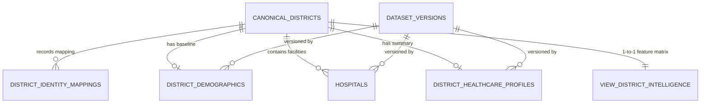

# VISTHAAPAN Phase 4.5: District Demographic & Healthcare Infrastructure Enrichment Audit

## Executive Summary

Phase 4.5 extends the VISTHAAPAN foundational data layer by ingesting three statutory national datasets, resolving administrative identity discrepancies across different eras of governance boundaries, quarantining corrupted infrastructure fields, and unifying disaster hazard intelligence, demographic baselines, and healthcare facility capacities into an authoritative relational schema and multi-domain feature matrix (`view_district_intelligence`).

All operations adhere strictly to data engineering boundaries: **zero ML models, zero OR-Tools allocation solvers, zero fabricated growth projections, and strict quarantine of corrupted hospital bed fields.**

---

## 1. Datasets Ingested

| Dataset | Source Agency | Raw Records | Filtered / Parsed | Primary Identifiers | Key Indicators Extracted |
| :--- | :--- | :--- | :--- | :--- | :--- |
| **District Master (LGD)** | Ministry of Panchayati Raj / NIC | 785 | 785 (100%) | `district_code` (LGD), `state_code` | State & district standard names, Census 2011 concordance codes |
| **Primary Census Abstract (PCA)** | Office of the Registrar General & Census Commissioner (ORGI) | 16,384 sheet rows | 640 (District Total) | `District` (Census Code 001–640), `State` | Total/Male/Female population, Child (0–6), SC, ST, Literate, Main/Marginal Workers, Households |
| **National Hospital Directory** | National Health Portal / MoHFW | 30,273 | 30,273 facilities | `Sr_No`, `Location_Coordinates` | 10,843 Point Geometries, Public/Private facility counts, Emergency services, Ambulances |

---

## 2. Database Schema & Architecture

Migration `009_create_phase4_5_district_enrichment.sql` established the following tables and views:

### Table 1: `canonical_districts`
- **Purpose**: Authoritative master identity directory of all 785 Indian districts across 36 States and Union Territories from the Local Government Directory (LGD).
- **Key Columns**: `id` (UUID PK), `district_code` (LGD Unique), `district_name`, `state_code`, `state_name`, `district_census2011_code`, `state_census2011_code`.
- **Constraint**: `UNIQUE(district_code)`.

### Table 2: `district_identity_mappings`
- **Purpose**: Transparent audit ledger of all cross-dataset matching results, resolution methods, and confidence scores.
- **Key Columns**: `source_dataset` (`NDEM`, `CENSUS_2011`, `HOSPITAL_DIRECTORY`), `source_state`, `source_district`, `canonical_district_id` (FK nullable), `mapping_status` (`EXACT`, `NORMALIZED_EXACT`, `CONTROLLED_ALIAS`, `UNMATCHED`, `AMBIGUOUS`), `mapping_method` (`CODE_MATCH`, `EXACT_NAME`, `NORMALIZED_NAME`, `ALIAS_LOOKUP`, `UNRESOLVED`), `confidence` (0.0 to 1.0), `notes`.
- **Constraint**: `UNIQUE(source_dataset, source_state, source_district)`.

### Table 3: `district_demographics`
- **Purpose**: Decennial demographic baseline indicators from Census 2011 Primary Census Abstract.
- **Key Columns**: `canonical_district_id` (FK), `data_reference_year` (= 2011 explicit), `population_total`, `population_male`, `population_female`, `population_child_0_6`, `population_sc`, `population_st`, `population_literate`, `population_worker`, `population_main_worker`, `population_marginal_worker`, `households_count`, `female_population_share`, `child_population_share`, `sc_population_share`, `st_population_share`, `literacy_rate`, `worker_participation_rate`.
- **Constraint**: `UNIQUE(canonical_district_id, dataset_version_id)`, ratio bounds `[0.0, 1.0]`.

### Table 4: `hospitals`
- **Purpose**: Individual facility-level directory with PostGIS spatial geometry and bed corruption flags.
- **Key Columns**: `canonical_district_id` (FK nullable), `hospital_name`, `state_raw`, `district_raw`, `hospital_category`, `hospital_care_type`, `latitude`, `longitude`, `geometry` (Point, 4326), `has_valid_coordinates`, `has_emergency_services`, `has_ambulance`, `raw_bed_count`, `is_bed_count_suspicious`.
- **Spatial Index**: `GIST(geometry)`.

### Table 5: `district_healthcare_profiles`
- **Purpose**: Aggregated healthcare facility presence and emergency readiness indicators per canonical district.
- **Key Columns**: `canonical_district_id` (FK), `hospital_count`, `geocoded_hospital_count`, `government_hospital_count`, `private_hospital_count`, `emergency_service_hospital_count`, `ambulance_available_hospital_count`, `geocoded_hospital_share`, `emergency_hospital_share`, `ambulance_hospital_share`.
- **Constraint**: `UNIQUE(canonical_district_id, dataset_version_id)`.

### View 6: `view_district_intelligence`
- **Purpose**: Unified multi-domain feature vector matrix joining NDEM disaster ground truth, Census 2011 demographics, and Hospital infrastructure.
- **Cardinality**: Exactly 785 rows (exactly 1 row per canonical district, 0 duplicate rows).
- **Features Exposed**:
  - `hazard_total_reports`, `hazard_active_events`, `hazard_diversity_count`, `primary_hazard_type`, `events_last_30_days`, `events_last_90_days`, `events_last_365_days`, `hazard_population_affected_total`, `hazard_deaths_total`, `hazard_breakdown`.
  - `census_reference_year`, `census_population_total`, `census_female_share`, `census_child_share`, `census_sc_share`, `census_st_share`, `census_literacy_rate`, `census_worker_rate`, `census_households_count`.
  - `hospital_count`, `geocoded_hospital_count`, `government_hospital_count`, `private_hospital_count`, `emergency_service_hospital_count`, `ambulance_available_hospital_count`, `geocoded_hospital_share`, `emergency_hospital_share`, `ambulance_hospital_share`.
  - `has_ndem_hazard_data`, `has_census_demographic_data`, `has_healthcare_data`.

---

## 3. Data Cleaning & Anomaly Audits

### 3.1 Bed Count Corruption Quarantine
- **Raw Analysis**: Out of 30,273 hospital records in `hospital_directory.csv`:
  - 30,209 rows had bed count `'0'`.
  - 11 rows had 10-digit telephone numbers stored in the bed count column (e.g. `9686825522`, `9844086438`).
  - Only 53 rows had plausible positive bed values.
- **Action Taken**: In accordance with the Phase 4.5 specification:
  - All records with 0, missing, or extreme (> 5,000) values are flagged with `is_bed_count_suspicious = true` (30,214 total).
  - **Bed counts are NEVER summed or used to claim shelter/hospital bed capacity.**
  - Facility count, geocoded facility count, emergency capability, and ambulance availability serve as the verified infrastructure signals.

### 3.2 Geospatial Coordinate Parsing & Validation
- **Raw Format**: Single string `Location_Coordinates` as `"latitude, longitude"`.
- **Validation Rules**: Parsed into float pairs. Coordinates are validated if `lat in [-90, 90]` and `lon in [-180, 180]` with `lat != 0` and `lon != 0`.
- **Results**:
  - Valid WGS84 Geocoded: **10,843 facilities (35.8%)** converted to PostGIS Point geometries in SRID 4326.
  - Over 10,000 facilities fall strictly within the terrestrial Indian bounding box `[6°N, 38°N] x [68°E, 98°E]`.
  - Facilities with missing or corrupt coordinates (19,430) are preserved with `has_valid_coordinates = false` and `geometry = NULL`.

### 3.3 Census 2011 Primary Census Abstract Extraction
- **Workbook Extraction**: The 16MB workbook `2011-IndiaStateDistSbDistTwn-0000.xlsx` contains 16,384 rows spanning national, state, district, sub-district, and town levels across Rural, Urban, and Total TRU categories.
- **Extraction Protocol**: Intermediate extraction script `scripts/extract_census_district_total.py` isolated exactly 640 rows where `Level == 'DISTRICT'` and `TRU == 'TOTAL'`.
- **Validation**:
  - District codes run sequentially from `001` to `640` across India.
  - Zero rural/urban double counting.
  - Reference year explicitly stored as `2011` (no unverified projection multipliers).
  - All demographic shares computed using safe division and rounded to 4 decimals within `[0.0, 1.0]`.

### 3.4 Administrative Concordance & Controlled Alias Normalization
Boundary changes between 2011 and 2026 (Telangana bifurcation, Ladakh UT creation, Daman & Diu merger, district subdivisons from 640 to 785) create naming divergences.
- **Concordance Architecture**:
  - `CanonicalDistrictIndex` matches on Census 2011 code (001-640), normalized state + district keys, and a controlled alias dictionary (`CONTROLLED_DISTRICT_ALIASES`).
- **Results**:
  - **Census 2011**: 640 / 640 districts matched (100.0% coverage of 2011 boundaries).
  - **NDEM Hazard Profiles**: 613 / 651 districts matched (538 exact/normalized, 75 controlled aliases). The remaining 38 entries are legitimate non-district administrative entries (`Statewide / Unspecified`, `Unknown District`, `Nazul`, `Mirpur`, `Muzaffarabad`) and are quarantined as `UNMATCHED` with 0.0 confidence.
  - **Hospital Directory**: 573 canonical districts with observed healthcare facilities.

---

## 4. Multi-Domain Coverage & Intersection Matrix

From `view_district_intelligence`:

| Coverage Domain | District Count | % of Canonical Districts (785) | Context / Interpretation |
| :--- | :--- | :--- | :--- |
| **Canonical District Master** | **785** | **100.0%** | Full statutory coverage across all 36 States/UTs |
| **Census 2011 Demographics** | **640** | **81.5%** | 100% of 2011 census boundaries. (The 145 unmapped districts are post-2011 creations, correctly left as NULL) |
| **NDEM Disaster Ground Truth** | **604** | **76.9%** | Districts with documented hazard events in NDEM repository |
| **Healthcare Facility Profile** | **573** | **73.0%** | Districts with facilities registered in National Hospital Directory |
| **Hazard ∩ Demographics** | **487** | **62.0%** | Districts with hazard history and census demographics |
| **Hazard ∩ Healthcare** | **431** | **54.9%** | Districts with hazard history and hospital infrastructure |
| **Demographics ∩ Healthcare** | **570** | **72.6%** | Districts with census demographics and hospital infrastructure |
| **Triple Intersection (All 3 Domains)** | **430** | **54.8%** | **Districts ready for immediate multi-domain AI model training in Phase 5** |

### Benchmark District Profile: Chamoli, Uttarakhand
The deterministic benchmark district exhibits complete multi-domain coverage:
- **Canonical District**: ID `05f45315-d2f0-4942-aee1-018cc53a8421`, LGD Code `47`, Census Code `057`.
- **Hazard Profile**: 385 total reports, 287 active events, 252 deaths, primary hazard `Transport Accident` / `Landslide`.
- **Demographic Baseline (2011)**: Population 391,605, female share 50.46%, literacy rate 71.64%.
- **Healthcare Infrastructure**: 6 registered facilities in National Directory.
- **Availability Flags**: `has_ndem_hazard_data = true`, `has_census_demographic_data = true`, `has_healthcare_data = true`.

---

## 5. Verification & Testing

The Phase 4.5 test suite (`test/enrichment.test.ts`) comprises **39 assertions across 6 suites**, all passing cleanly:
1. **Canonical District Master (LGD)**: 785 districts, 36 States/UTs, 0 duplicate codes, >= 640 census concordance codes.
2. **Census 2011 Demographics Baseline**: 640 districts, reference year 2011, ratio bounds `[0.0, 1.0]`, Chamoli population 391,605.
3. **Hospital Infrastructure & Geocoding**: 30,273 records, 10,843 Point geometries, WGS84 valid extents, >10,000 Indian terrestrial points, >30,200 quarantined bed counts, 573 district profiles.
4. **NDEM Concordance & Identity Ledger**: 651 source districts, 613 matched, 38 quarantined non-districts with confidence 0.0.
5. **Unified Intelligence View**: Exactly 785 rows, 0 duplicate districts, 430 triple-intersection districts, Chamoli multi-domain validation.
6. **Provenance & Idempotency**: 4 authoritative data sources, 4 dataset versions, 4 data quality scores, idempotency on repeated execution.

---

## 6. Readiness for Phase 5

Phase 5 (AI Vulnerability Scoring, Red Zone Spatial Generation, and Dynamic Risk Synthesis) will directly consume:
1. `view_district_intelligence` as the primary multi-domain training feature matrix.
2. `canonical_districts` as the persistent foreign key anchor across all spatial and risk entities.
3. `hospitals` Point geometries (`geometry`) for spatial buffer and lifeline proximity queries.
4. Quarantined bed flags ensuring no algorithms rely on corrupted bed capacity values.
